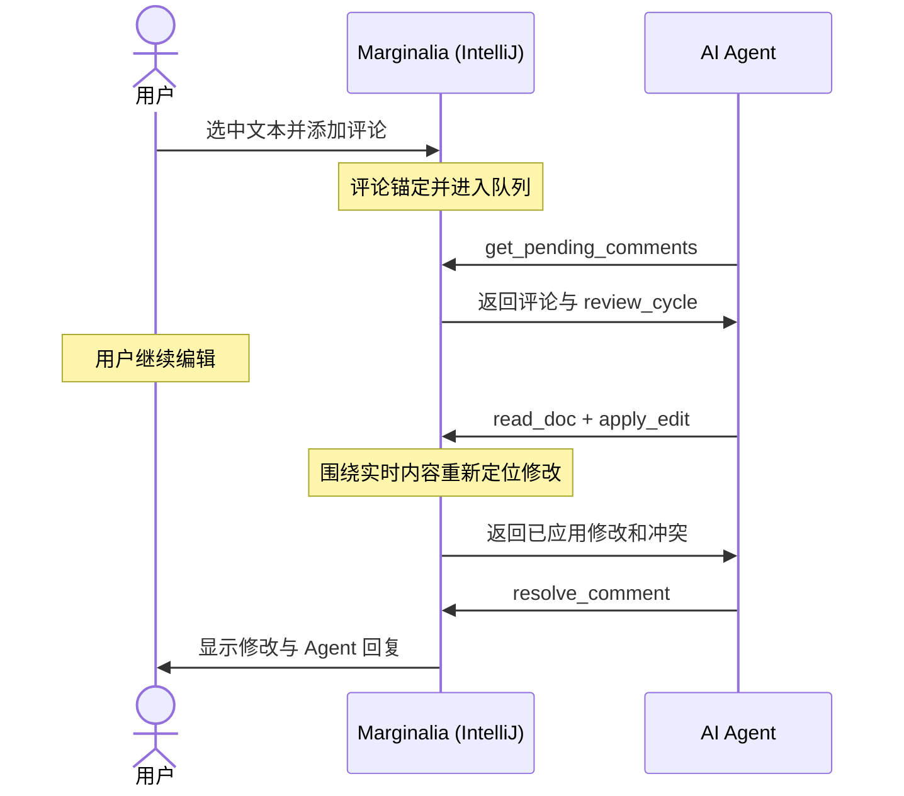

# Marginalia

> 像审查 Pull Request 一样审查 AI Agent 的工作：直接在编辑器里选中代码、留下批注，并让 Agent 在同一个缓冲区中完成修改。


[](https://plugins.jetbrains.com/plugin/32287)

Marginalia 在 JetBrains IDE 与 AI 编程 Agent 之间建立一个实时协同编辑界面。你可以像审查 PR 一样，对文档或代码中的具体范围添加评论。Agent 通过本地 MCP 服务领取评论，并把修改合并回你正在编辑的缓冲区。即使你和 Agent 同时修改文件，合并引擎也会重新定位改动，避免覆盖你的输入。

Marginalia 是 Agent 的审查侧栏，不是 Agent 的外壳。Claude Code、Codex CLI 或其他支持 MCP 的 Agent 仍然保留自己的终端、技能和工作流，Marginalia 只负责把 IDE 中的评论与实时缓冲区交给它们。


## 致谢

Marginalia 最初由 [borgand](https://github.com/borgand) 创作，原始项目位于 [borgand/marginalia](https://github.com/borgand/marginalia)。代码范围锚定、实时缓冲区协作、MCP 工具和用户优先的合并策略，都来自原作者建立的设计基础。

本仓库在此基础上继续维护中文界面、Codex 工作流和多轮复审能力。感谢 borgand 公开这个项目，也向原作者扎实而克制的产品设计致敬。

## 快速开始

### 1. 安装插件

可以从 [JetBrains Marketplace](https://plugins.jetbrains.com/plugin/32287) 安装公开版本：

<kbd>设置</kbd> → <kbd>插件</kbd> → <kbd>Marketplace</kbd> → 搜索 `Marginalia` → <kbd>安装</kbd>

也可以从源码构建当前仓库版本：

```bash
./gradlew buildPlugin
```

然后在 IDE 中选择：

<kbd>设置</kbd> → <kbd>插件</kbd> → <kbd>齿轮菜单</kbd> → <kbd>从磁盘安装插件</kbd>

构建产物位于 `build/distributions/`。

### 2. 注册 MCP 服务

Claude Code：

```bash
claude mcp add --transport http marginalia http://localhost:4747/mcp
```

Codex：

```bash
codex mcp add marginalia --url http://localhost:4747/mcp
```

Marginalia 默认监听 `http://localhost:4747/mcp`。注册后需要重新启动正在运行的 Agent 会话，让它重新读取 MCP 配置。

### 3. 安装 Claude Code 集成

Claude Code 用户可以执行：

<kbd>工具</kbd> → <kbd>Marginalia：安装 Claude Code 集成</kbd>

该操作会安装：

- `~/.marginalia/marginalia-hook.sh`，用于拦截协同编辑文件上的原生 `Edit` 和 `Write`
- `~/.claude/settings.json` 中的 `PreToolUse` Hook
- `~/.claude/commands/marginalia.md`，也就是 `/marginalia` 命令

这部分依赖 `jq`。Codex 或其他 MCP 客户端不需要安装 Claude Code Hook。

### 4. 添加评论

打开文件，选中一段内容，按 <kbd>Ctrl/Cmd+Alt+M</kbd> 输入评论。也可以使用选择文本后出现的浮动工具栏按钮。

Claude Code 用户运行 `/marginalia`。Codex 用户可以直接要求 Agent “处理 Marginalia 审查评论”。Agent 会通过 `get_pending_comments` 领取评论，读取 IDE 中的实时缓冲区，应用修改并回报处理结果。

## 为什么需要 Marginalia

只靠聊天描述修改位置，很快会遇到几个问题：

- “改一下部署章节下面第三段”并不是可靠的定位方式。选中原文并批注更直接。
- Agent 整体重写文件时，可能覆盖你刚输入的内容，或者让评论引用失效。
- 如果只能轮流编辑，你必须等 Agent 完成后才能继续工作。

Marginalia 把评论锚定在文本范围上，并让双方继续使用同一个缓冲区。你可以一边审查一边输入，Agent 的修改会围绕你的最新内容重新定位。

| 工作方式 | 仅使用聊天 | 使用 Marginalia |
| --- | --- | --- |
| 指定修改位置 | 用自然语言描述 | 选中文本并添加评论 |
| 你继续编辑 | Agent 上下文可能过时 | Agent 下一轮读取实时缓冲区 |
| Agent 写回修改 | 文件重载可能覆盖输入 | 在当前缓冲区原位合并，冲突时用户优先 |
| 并行工作 | 通常需要等待当前轮次结束 | 可以继续输入和添加评论 |
| Agent 界面 | 使用原生界面 | 仍然使用原生界面 |

## 主要能力

### 锚定到文本的 PR 式评论

评论绑定的是文本范围，而不是固定行号。双方编辑文件时，范围会随文档变化移动。关闭并重新打开 IDE 后，插件会根据保存的片段和偏移重新建立锚点。

### 用户优先的合并引擎

Agent 的修改会经过 Marginalia 合并引擎。引擎按精确匹配、忽略空白匹配和模糊匹配的顺序重新定位修改块。如果 Agent 的改动与你刚写的内容冲突，你的版本会被保留，冲突信息则返回给 Agent，并显示在工具窗口中。

### 审查队列与明确状态

工具窗口按文件组织评论，并区分以下状态：

- `草稿`：自动入队关闭时，新评论尚未提交
- `待 Agent 领取`：评论已入队，等待 `get_pending_comments`
- `已交付`：Agent 已领取评论
- `Agent 已处理`：Agent 已提交处理结果，等待人工确认
- `已解决`：用户确认关闭评论

【提交审查】只会把草稿批量加入待领取队列。自动入队开启时，新评论会直接进入“待 Agent 领取”。

### 多轮复审

如果 Agent 驳回意见，或者第一次修改不符合预期，可以对同一条评论选择【重新入队】。插件会要求填写新的复审理由，并保留原始意见、每一轮理由和 Agent 回复。

每次复审都有独立的 `review_cycle`。旧轮次的 Agent 回复不能错误地解决较新的轮次。评论卡片展示最新一轮，完整记录可以从右键菜单中的【查看复审历史】打开。

### 原生 Markdown 阅读体验

对于 `.md` 文件，Marginalia 直接在 IntelliJ 编辑器中添加视觉装饰，不使用 WebView，也不修改原始文本。Agent 与用户看到的文件内容保持一致。

### 不绑定特定 Agent

本地服务使用 MCP Streamable HTTP。任何支持该协议的 Agent 都可以连接。项目主要针对 Claude Code 开发和测试，也支持 Codex CLI、OpenCode 等 MCP 客户端。

## 工作原理



1. 添加评论会自动把文件注册为协同编辑文档。
2. Agent 通过 `get_pending_comments` 领取已入队评论。该工具支持最长 30 分钟的长轮询。
3. Claude Code 的 `PreToolUse` Hook 会阻止协同编辑文件上的原生 `Edit` 和 `Write`，并要求 Agent 使用 `mcp__marginalia__apply_edit`。
4. `apply_edit` 以 `read_doc` 返回的缓冲区版本为合并基准。部分成功是正常结果，无法安全应用的修改会作为冲突返回。
5. Agent 使用当前 `review_cycle` 调用 `resolve_comment`，插件随后把该轮标记为已处理。

## 持续监听评论

Claude Code 推荐直接运行一次 `/marginalia`。命令会用 30 分钟长轮询等待评论，评论进入队列后立即返回。连续三次等待超时后，也就是大约 90 分钟没有新评论时，命令会自行结束，避免遗忘的会话持续消耗额度。

也可以运行：

```text
/loop Use MonitorTool to poll /marginalia command for new comments
```

这种方式适合明确需要后台循环的场景，但 `/loop` 不会自动停止。原项目曾记录过一次闲置过夜的 `/loop` 会话，在没有完成有效工作的情况下产生约 150 美元费用。使用前应确认会及时结束它。

不建议使用旧写法 `/loop 1m /marginalia`。它每分钟重新执行完整命令，即使没有评论也会持续消耗 token。

## 常见工作流

### 边读边审

先让 Agent 运行 `/marginalia` 或等待 Marginalia 评论。阅读文档或代码时，选中需要修改的内容并添加评论。自动入队开启后，评论会被长轮询立即领取，你可以继续阅读和输入。

### 批量提交审查

关闭自动入队，跨多个文件积累草稿评论，然后点击【提交审查】。所有草稿会一起进入 Agent 待领取队列，适合需要统一处理的一组修改。

### 直接编辑与评论并行

你可以亲自修改一部分内容，同时在其他位置添加评论。Agent 下一轮通过 `read_doc` 读取实时缓冲区，不需要额外同步。

### 对 Agent 修改再次复审

Agent 完成修改后，如果结果不合适，可以在原评论上选择【重新入队】，说明新的要求。评论继续使用同一锚点和 ID，历史轮次不会丢失。

## 安装与设置

要求：

- 任意基于 IntelliJ Platform 的 JetBrains IDE，例如 IntelliJ IDEA、PyCharm、WebStorm、GoLand 或 Rider
- 一个支持 MCP Streamable HTTP 的 Agent
- 使用 Claude Code 自动集成时，需要在 `PATH` 中提供 `jq`

MCP 端口和 Markdown 渲染选项位于：

<kbd>设置</kbd> → <kbd>工具</kbd> → <kbd>Marginalia</kbd>

## Markdown 渲染

渲染功能建立在 IDE 自带的 `org.intellij.plugins.markdown` PSI 上，所有效果都是临时装饰，不会改写缓冲区。

默认启用：

- H1 到 H6 标题样式、粗体、斜体、删除线和彩色列表标记
- 引用块左侧强调线和横线绘制
- 链接目标、YAML Frontmatter 和 HTML 注释折叠
- 图片预览与 Mermaid 图表的装订区图标
- H1、H2 大标题和表格网格渲染

内联图片折叠默认关闭，可以在设置中开启。标题大纲使用 IDE 自带的 Structure 视图：

<kbd>视图</kbd> → <kbd>工具窗口</kbd> → <kbd>Structure</kbd>

也可以按 <kbd>Cmd+7</kbd> 或 <kbd>Ctrl+F12</kbd>。

颜色可以在以下位置调整：

<kbd>设置</kbd> → <kbd>编辑器</kbd> → <kbd>配色方案</kbd> → <kbd>Marginalia</kbd>

## MCP 工具

完整契约见 [docs/main-prd.md 的第 6 节](docs/main-prd.md)。

| 工具 | 用途 |
| --- | --- |
| `list_co_edited_docs` | 列出当前协同编辑文件及缓冲区版本 |
| `read_doc` | 读取 IDE 实时缓冲区，并记录后续合并使用的基准版本 |
| `apply_edit` | 通过合并引擎应用 `old_text → new_text` 修改 |
| `get_pending_comments` | 领取待处理评论，返回当前复审轮次和历史，并标记为已交付 |
| `resolve_comment` | 使用匹配的 `review_cycle` 标记当前轮次已处理 |

## 开发

```bash
./gradlew test
./gradlew verifyPlugin
./gradlew runIde
./gradlew buildPlugin
```

- `test`：运行单元测试和轻量平台测试
- `verifyPlugin`：检查插件结构及 IntelliJ Platform API 兼容性
- `runIde`：启动沙盒 IDE 进行手动测试
- `buildPlugin`：在 `build/distributions/` 生成可安装 ZIP

架构说明见 [CLAUDE.md](CLAUDE.md)，产品需求和 MCP 契约见 [docs/main-prd.md](docs/main-prd.md)。

## 许可与来源

本项目采用 [MIT License](LICENSE)。项目基于 [IntelliJ Platform Plugin Template][template]，并延续 [borgand/marginalia](https://github.com/borgand/marginalia) 的工作。

[template]: https://github.com/JetBrains/intellij-platform-plugin-template
